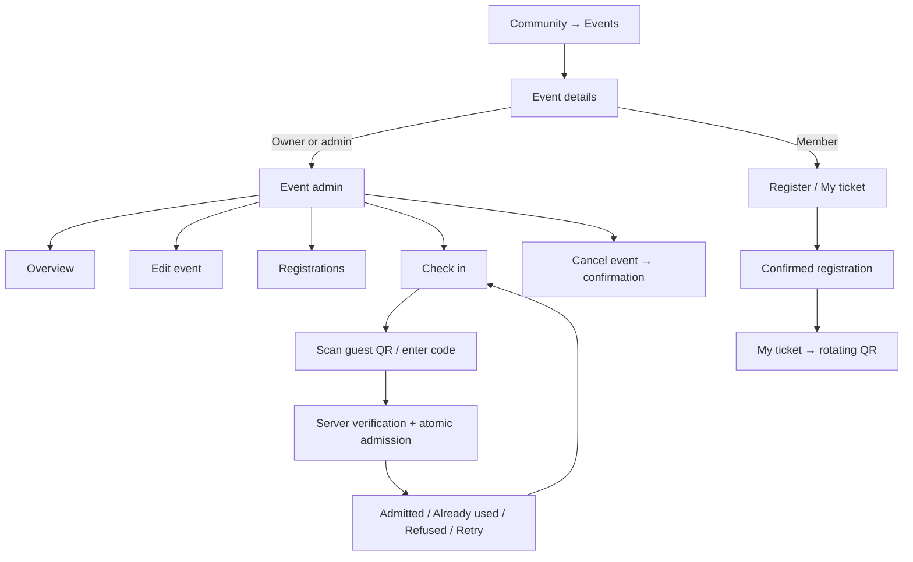

# Community event admin — proposed flow

Status: implementation started after user approval. The initial planning-only pause has ended. See the implementation checkpoint below for completed source changes and remaining integration work. Backend event-finance/staff source and migrations 067–069 were deployed on 2026-09-10; see the deployment checkpoint below. Existing QR, Moments and notification work is preserved.

## Outcome

A community owner/admin opens an event in the iOS or Android app and sees an **Event admin** entry. It opens a dashboard for that event: details, registrations, attendee counts and ticket check-in. Ordinary members see the event details and their own registration/ticket. Event access must not grant access to unrelated communities, private messages or platform administration.

The planned scope includes free and paid events. Paid registration is gated on a configured provider, verified checkout/refunds and an agreed organiser settlement model. Cancelling an event must never imply that a refund happened.

## Current implementation and gaps

- The backend already exposes event creation, details, editing, publishing, cancellation, registrations, personal tickets, rotating ticket codes and check-in.
- `communityAccess` requires active membership and restricts organiser actions to the community owner/admin. Suspended communities are rejected.
- iOS already routes hosts from the event list to `EventHostView`. It has publish/cancel, an order list and typed ticket-code check-in. Event editing and camera-based check-in are missing.
- Android's event list currently exposes member RSVP actions. It does not receive the manager permission flag or open an event-host dashboard; its event service lacks host methods.
- The registrations endpoint currently returns at most 500 orders. A dashboard must expose pagination rather than presenting this partial list as the full attendance count.
- Check-in verifies signed codes, event identity, nonce rotation, ticket/order validity and duplicate use. Inspection found no explicit event-status/suspension gate in that handler. This must be fixed before shipping admission controls.
- Patch validation must compare the resulting start/end times, including when only one date changes. Check mutation-time authorisation and cancellation/refund/check-in races as part of the backend work.

## Roles

| Action | Community owner/admin | Event check-in staff (proposed) | Member |
|---|---|---|---|
| Create/edit/publish/cancel event | Yes | No | No |
| View registrations and attendee totals | Yes | Limited admission totals only | Own registration only |
| Scan tickets and admit guests | Yes | Assigned events only | No |
| See a guest's name following a scan | Yes | Yes, only the scanned ticket holder | Own ticket only |
| Appoint/remove event staff | Yes | No | No |
| Grant community admin rights | Existing community role rules | No | No |

**Updated scope:** include event managers and volunteers in the proposed first release, following the restaurant/team requirement. The expanded role and invitation flow below supersedes the initial owner/admin-only recommendation. This requires server-side event grants; the current community role model does not provide them.

For Voiid Jobs, Feedback and Updates, authorised platform admins should reach the same event operations from the web admin panel through its audited official-community controls. This privilege must remain limited to those three communities. Ordinary community managers use their own community permissions.

## Screen flow

### 1. Events list

- Members see published/cancelled events they may access; drafts are organisers-only.
- Owners/admins also see **Create event**, status chips, and a clear **Manage** action on each event.
- Use the same entry point and labels on both apps. Do not depend on a hidden long-press menu.
- Loading, empty and failed states are separate. Retry is visible.
- Preserve current membership requirements in this release. Public event browsing outside community membership is a separate scope decision.

### 2. Create and edit

Fields: title, description, start date/time, optional end date/time, location, capacity or unlimited. Dates display in the user's timezone; requests carry explicit offsets/UTC.

Create → Save draft → Review → Publish. Drafts are not visible to members. Publishing is explicit. A successful response updates the list and dashboard from server data.

Editing a published event preserves existing registrations. Reducing capacity below registrations stops new bookings but does not silently remove guests. The UI explains that before saving. Cancelled events are read-only.

No optimistic success, duplicate submissions or silent dismissal during saves. Retain entered fields on failure.

### 3. Event admin dashboard

Header: event name, date, location and status.

Overview shows:

- Confirmed registrations (orders), distinctly labelled.
- Tickets issued / registered places (quantity), distinctly labelled.
- Checked in / not checked in.
- Capacity and remaining places, or Unlimited.

Actions: **Edit event**, **Registrations**, **Check in**; drafts offer **Publish**; draft/published events offer **Cancel event**. Counts come from full server aggregates, not the number of rows loaded on the phone.

### 4. Registrations and attendees

Search by attendee name/username; filter confirmed, pending, cancelled/refunded and checked-in state. Paginate the list. Each row shows name, ticket quantity, registration status and checked-in quantity. One registration containing several tickets must not appear as one admitted attendee.

Refresh after an admission and on returning to the dashboard. Detail access remains authorised server-side. Do not expose phone numbers, payment credentials, private chats or unnecessary account data.

Registration cancellation and refunds are distinct from cancelling the whole event. For the initial free-event scope, decide whether organisers may revoke individual registrations; do not add a destructive revoke button until that behaviour and confirmation copy are reviewed.

### 5. Guest registration and ticket

Member → Register → Confirmed → View ticket. If already registered, show My ticket instead of creating another order. The ticket displays event name/date, status and a short-lived QR, with refresh/recovery if unavailable. Android needs a reachable ticket screen as part of this complete flow.

The QR is a signed ticket capability, not a community invitation or profile link. It must not reveal raw user details. Ticket refresh/rotation follows the existing server protocol; show expired/cancelled/unavailable states honestly.

### 6. Door check-in

Admin opens a specific event → Check in → scanner. The event name stays visible to prevent scanning for the wrong event. Camera denial has a settings link and manual code entry fallback.

**Proposed fast door flow:** scan → stop detection → server verifies and atomically admits → show the result. A separate Check in button is used for manually entered codes. Scanning is an explicit admission action on this event-scoped screen; it must not perform admission from the general profile/community scanner.

Results:

- **Admitted:** holder name, admission time, updated count; clear Scan next action.
- **Already checked in:** distinct from success, show prior time; do not increment totals.
- **Wrong event / expired / revoked / unpaid / cancelled or suspended event:** clear refusal and recovery guidance where possible.
- **Offline / timeout:** no success claim. A timeout may follow a committed admission; retry must return the existing checked-in result without a second admission.

Keep the camera paused while the result is visible so one QR cannot trigger repeated requests. Leaving/backgrounding the screen releases the camera and torch. No offline admission in the first release.

### 7. Event cancellation

Cancel event → confirmation with event name and affected registration count → submit → server confirms → mark Cancelled everywhere.

Stop new registrations and check-in. Preserve historical registration/admission records. Tell attendees through the existing event communication mechanism once that delivery path is verified; notification taps must open this event, not a guessed conversation. Notification delivery failure must not roll back a completed cancellation; use a retryable outbox if event notifications are added.

## Security and lifecycle requirements

- Every host request checks current permissions; hiding controls is insufficient. Removing an admin/staff member must remove future access without requiring sign-out.
- Event staff, if implemented, have event-specific grants, not community role escalation.
- Admission checks event status, ticket identity, current nonce, order state and permissions. Concurrent attempts and cancellation/refund/revocation races need atomic handling.
- Record organiser actions and admissions with actor, event, timestamp and outcome. Never log raw ticket QR tokens.
- After permission revocation, clear previously loaded private registration views and show Access removed.
- Keep scanner modes separate: profile/community scanning, linked-device authorisation and event check-in have different permissions and actions.

## Delivery sequence and acceptance

1. Agree on the expanded team, wallet and visibility flow below; settle individual registration revocation separately.
2. Audit and harden backend status/date/permission checks; add full aggregate counts and paginated registrations.
3. Build matching iOS/Android event dashboards and editing; complete guest ticket access.
4. Connect camera check-in and explicit success/refusal states. Wire official web-admin event entry points.
5. Validate with isolated data, then real devices/accounts. Deploy only the validated backend changes and install both builds.

Required checks: owner/admin versus ordinary member; removed admin; wrong community/event; draft privacy; create/edit/publish/cancel; clearing optional end/capacity; capacity races; multiple-ticket registrations; pagination beyond 500; QR expiry/rotation; duplicate and concurrent scans on two phones; cancellation/revocation during check-in; network loss before/after admission; permission denial/background camera cleanup; correct guest ticket/event notification routing. Never claim completion from compilation alone.

No production event, registration or role should be created or modified merely for this planning step.

## Restaurant teams: access and screens

Proposed scope added after user feedback; planning only. A restaurant operates its own community. Its owner configures event staff through **Community → Manage → Team**, or **Event → Manage → Team** for one event. Existing community admins retain existing authority; the new Event manager role does not silently grant community admin rights.

| Role | Scope and visible tools |
|---|---|
| Owner / existing community admin | Existing community powers; owner controls ownership, community roles and event-team appointments under existing role rules |
| Event manager | Assigned events, or explicitly all events of this community: create where authorised, edit/publish/cancel, registrations, aggregate Insights, check-in; no ownership changes or community moderation |
| Volunteer | Assigned event and optional shift only: Check in, limited admission totals, scanned guest result; no full registration directory, exports, analytics or event editing |
| Guest | Event details, own registration and ticket; no staff tools |

Owner/admin chooses a Voiid account, role, event scope and optional expiry → recipient gets an invitation → opens a screen naming the restaurant, events and permissions → accepts while signed in to the intended account → server activates the grant. For non-members, require the existing community membership/approval flow before activation. Do not bypass active-membership checks through staff invites.

Invitations are recipient-bound, single-use, expiring and revocable. A forwarded link or community QR cannot grant a role. Owners/admins can see Pending/Active/Expired/Removed entries and revoke access. Event managers cannot appoint other managers or volunteers in the initial version; this keeps delegation unambiguous.

**Where staff find it:** Community → **Staff tools**, visible only to authorised staff, with **My assigned events**. Each event also exposes **Manage event** to managers or **Check in** to volunteers. Invitation notifications deep-link to the invitation, subsequent event notifications to the authorised event screen. Cold launch/sign-in resumes the intended destination after current access is verified. No separate staff app or shared restaurant login.

Example: restaurant owner assigns Priya as event manager and Rahul as volunteer for Friday's dinner event. Priya sees overview, editing, registrations and Insights; Rahul sees Friday's check-in screen. Neither assignment exposes unrelated communities or private chats. Removing Rahul denies the next admission request and clears his staff screen.

## Add to Wallet

Guest flow: Event → Register → Confirmed → My ticket → **Add to Apple Wallet** on iOS or **Add to Google Wallet** on supported Android devices. Keep My tickets in Voiid available regardless of wallet support. Issue a separate pass per ticket/place, not one reusable pass for an entire multi-ticket order.

Pass content: restaurant/community name, event name, time, venue, ticket identifier and admission QR; include an Open in Voiid destination. Avoid unnecessary personal data. A wallet ticket grants admission only, never staff access. This proposal covers event tickets, not restaurant loyalty cards, stored money or payment cards.

Dependencies: Apple pass signing/certificate and pass update service; Google issuer setup, credentials and publishing access. Verify availability/configuration before enabling buttons. Credentials and barcode secrets stay on trusted servers. Issuing a pass and saving it to a wallet are distinct outcomes; cancellation or failed saving must leave the Voiid ticket usable.

**QR design gate:** do not copy the current short-lived Voiid QR into a pass and let it expire. Google documents rotating event-ticket barcodes. Validate the supported Apple barcode mechanism on target devices before promising equal rotation. If a persistent Apple pass credential is necessary, explicitly review its screenshot/forwarding risk; a server-checked single-use credential prevents duplicate admission but cannot prove who presented it first. Never silently weaken a rotating ticket with a static fallback. Both wallet and in-app credentials must resolve to the same ticket and atomic admission record, so admission through one invalidates use through the other.

Wallet updates can lag. Event cancellation, ticket revocation and prior admission are enforced by the check-in server immediately; the displayed pass is not proof of validity. Guests may display saved passes offline, but staff admission remains online in this release. Test save/re-add, cancelled save, expired credentials, lost connectivity, event edits/cancellation, copied QR, app-versus-wallet concurrent scans and revoked staff.

Official references checked for this plan:
- Apple Wallet setup/signing: https://developer.apple.com/wallet/get-started/
- Apple pass updates: https://developer.apple.com/library/archive/documentation/UserExperience/Conceptual/PassKit_PG/Updating.html
- Google issuer onboarding: https://developers.google.com/wallet/tickets/events/getting-started/onboarding-guide
- Google rotating barcodes and static-fallback risks: https://developers.google.com/wallet/tickets/events/resources/rotating-barcodes

## Visibility and Insights

“Views” can mean the staff screens or audience reach; the plan covers both. Staff screen access is described above. For reach, propose this funnel:

**Discover / community feed / shared event link or community QR → event details → registration → ticket → check-in.**

- Public, discoverable restaurant communities appear in Discover and search subject to existing visibility/moderation rules. Event posts link to the actual event. Share links and QR preserve that destination through sign-in and any required community join; private content never becomes public through sharing.
- Within the community, managers can publish an event card and pin it where their existing posting permissions allow. Notify eligible members through their notification preferences; do not promise views or broadcast unsolicited notifications across Voiid.
- A public event landing-page preview outside membership is an optional follow-up, not a silent change to current member-only event access. A featured/local-events discovery surface also requires separate product/moderation scope; initial reach uses existing Discover plus community distribution.
- **Manage event → Insights** for owners and authorised managers: feed impressions, unique event viewers, confirmed registrations, tickets issued, check-ins and view-to-registration conversion. Clearly distinguish orders, tickets and people.
- Define a qualified impression as at least 50% of the event card visible for one second while the app is foregrounded; deduplicate per card exposure/session. A detail view counts when the authorised event actually renders, not on prefetch or notification receipt. Unique viewers are deduplicated per event and selected reporting period; the same person on two devices counts once where signed-in identity is available. Exclude organiser/staff/test activity from audience metrics.
- Track anonymous aggregate source categories such as Discover, community, share or notification; avoid raw URLs/tokens and do not expose viewer identities. Treat client exposure/view counts as approximate, filter repeat/spam traffic, and use server registration/admission records as the source for conversions.
- Show date range, reporting timezone and last update. No fabricated historic views: display Tracking starts on [activation date] and separate unavailable data from zero. Define conversion as unique viewers who subsequently register in the stated window divided by unique viewers, rather than dividing ticket quantity by views.
- Analytics requires its own authorised aggregation endpoints, event retention policy and deletion handling. Volunteers never receive the underlying viewer/registration dataset. Wallet save taps are not confirmed saves or wallet opens; report only outcomes supported by each integration.

Expanded delivery order: permissions and invitations → shared event administration/guest tickets → online check-in → wallet compatibility prototype and issuer setup → wallet delivery → distribution and measured Insights. Verify role isolation, notification routing and each funnel stage on both native platforms before claiming completion.

## Paid events and organiser payments

User-requested scope: include paid event registration alongside free RSVP. This section is a proposal, not a working payment integration. The current backend has checkout/webhook abstractions but its provider registry is empty; live paid checkout is not ready.

**Organiser:** Create event → Free or Paid → ticket price/currency, capacity, cancellation/refund policy → review the guest total and organiser fees/settlement terms → publish. Enable paid publishing only after the organiser's payment onboarding and provider configuration are ready. Do not assume the platform can collect funds for every restaurant into one account.

**Guest:** Event → Get tickets → quantity → order summary showing ticket subtotal, applicable fees/taxes and final total → provider checkout → Verifying payment → confirmed ticket → Add to Wallet. Failed/cancelled checkout offers a safe retry; pending verification survives app termination and is reachable through My bookings. A checkout redirect/client success callback alone never issues tickets. Verify provider payment status, amount, currency and order identity server-side; handle signed webhook retries and out-of-order delivery idempotently.

**Capacity:** define a timed reservation during checkout with server-side enforcement. Release unpaid reservations on expiry. If a payment arrives after expiry and no seat remains, route it to an explicit recovery/refund workflow rather than overselling or silently losing the payment. Repeated taps and reconnects must not create duplicate charges/orders.

**Dashboard:** registrations show payment status; authorised managers see event revenue/refund summaries. Separate collected, refund pending, refunded, fees and settled amounts. Only owners or explicitly authorised finance operators can initiate refunds or change settlement details; volunteers receive no financial data. Payout account changes require renewed authentication and an audit trail.

**Cancellation/refund:** distinguish a cancelled event, a revoked ticket, a requested refund and a completed refund. Show policy and any non-refundable charges before purchase. Event cancellation blocks admission and triggers the agreed refund workflow; update the guest and wallet ticket while tracking provider-confirmed refund completion. Support reconciliation when callbacks are missed and an auditable recovery path for failed refunds. Partial refunds, disputes and payout reversals must be designed before enabling situations that require them.

**Decisions before integration:** supported countries/currencies, linked-account onboarding, platform fees and refund authority/policy. Provider selection and applicable payment/store requirements need verification against the actual physical-versus-digital event offering. Processor decision updated below: Razorpay Checkout with Razorpay Route. Commercial fees and settlement terms remain undecided.

Acceptance: successful/failed/cancelled/pending checkout, double tap, app killed during payment, late/duplicate/out-of-order webhook, wrong amount/currency, last-seat concurrency, expired hold with late payment, full/partial refund where supported, cancelled event, reconciliation and settlement permission isolation. Validate in provider sandbox before live enablement.

## Tournaments: temporary native visibility change

Per user request, hide tournament sections in iOS/Android communities and the iOS Games tournament section, including its automatic tournament fetch. Preserve tournament source and backend data. Re-enable only through an explicit post-launch release decision, not automatically based on date or app availability. This is UI hiding, not disabling the backend tournament API or changing older installed clients. Native build/install validation is separate from this source change.

## Payment decision: Razorpay Checkout + Route

User selected Razorpay with Route. Proposed architecture: guest pays through Razorpay Checkout → backend verifies captured payment and confirms the ticket → Route transfers the organiser share to that restaurant's onboarded Linked Account according to the agreed release policy → track settlement separately. Platform fees must be explicit and reconciled; transfer completion does not equal bank settlement. Do not delay a valid ticket merely because a subsequent transfer is pending; surface and reconcile transfer failures independently.

Before live enablement, verify Route activation/eligibility for Voiid, linked-account onboarding requirements, fees and the permitted settlement/hold model with Razorpay. Keep checkout, transfer, reversal, refund and settlement records separate and idempotent. Refunds after a transfer require the supported reversal/refund workflow; never assume cancelling an event reverses a bank settlement automatically.

For the proposed in-person restaurant events, this is payment for a service consumed outside the app, not Apple In-App Purchase or Google Play Billing. Razorpay checkout may open from inside Voiid; a browser redirect is not what determines the classification. Apple guideline 3.1.3(e) requires other payment methods for such physical goods/services; Google excludes physical services including live-event tickets from Play Billing. Restrict this initial paid flow to physical attendance. Digital access, paid community features, streamed events and mixed bundles need separate policy review; merely naming something an event does not create an exemption.

Sources verified on 2026-09-10:
- https://razorpay.com/docs/payments/route/
- https://razorpay.com/docs/payments/route/linked-account/
- https://developer.apple.com/app-store/review/guidelines/ (3.1.3(e))
- https://support.google.com/googleplay/android-developer/answer/9858738?hl=en

This records the chosen integration direction; it does not claim that Route is activated or paid checkout is implemented.

## Clarification: Voiid-managed Route and community Wallet

Voiid owns the Razorpay gateway/Route integration and commission configuration. Restaurants do not supply separate Razorpay API keys or integrate checkout themselves. An authorised community owner completes the recipient onboarding inside Voiid; the backend creates/maps that legal recipient to a Razorpay Linked Account. Required business/identity verification still applies. Bind recipient changes to explicit owner authority; community membership or event manager status alone cannot redirect funds.

Entry: **Community → Manage → Wallet**. This is an event earnings and settlement dashboard, distinct from guest Apple/Google Wallet tickets. Show gross ticket sales, Voiid commission, processing fees/taxes as agreed, refunds/adjustments, net earnings, pending settlement, settled to bank and transaction history. Compute balances from reconciled server records; do not equate gross receipts with withdrawable funds. No top-ups, peer transfers or general stored-value functionality in this scope.

Setup flow: Wallet → Set up payouts → business/recipient details required by Razorpay → beneficiary name, bank account number and IFSC → verification → Active/Needs information/Failed. Mask saved bank details, require renewed authentication for changes, reverify the recipient and audit changes. Do not log full banking fields. Owner and explicit finance role only can manage payouts; ordinary event managers receive only authorised event summaries, volunteers no Wallet access.

UPI distinction: guests may pay using supported Razorpay UPI checkout methods. Route's documented linked-account settlement flow uses bank details; an organiser UPI ID is not assumed to replace account number and IFSC. Do not display a working UPI payout option unless Razorpay explicitly supports and enables it for the chosen product/account. Any separate payout product requires its own integration review.

Payment flow: guest payment → verified captured order → ticket issued → recorded Voiid commission and organiser net share → Route transfer → bank settlement status. Snapshot the fee agreement per order so future commission changes do not rewrite past earnings. Automatic settlement is the initial proposal. Do not offer Withdraw now or promise an available balance until the supported settlement controls and timing have been agreed. Track transfer failures, reversals and negative adjustments independently of ticket issuance.

Illustrative split only: ₹1,000 ticket with a hypothetical 5% Voiid commission gives ₹50 commission and ₹950 organiser share before separately agreed processing fees, taxes and refunds. Neither the 5% rate nor who bears other charges has been selected.

References: https://razorpay.com/docs/payments/route/linked-account/ and https://razorpay.com/docs/payments/route/integration-guide/ . Planning only; no payment account or recipient has been created.

## Implementation checkpoint — 2026-09-10

Confirmed commercial decision: default Voiid commission is **25%**, platform-admin override per community. It applies to new orders. Database migration 067 snapshots commission and organiser share at order creation, with whole-minor-unit rounding down for commission and the remainder allocated to the organiser. Historical orders are explicitly unpriced rather than retroactively charged. The basis is ticket subtotal; processing fees/taxes/refund allocation still need final terms before charging guests.

Implemented in source:
- Platform admin → Communities → community detail → Event finance: commission override with required reason/conflict detection, sales grouped by currency/status, paginated order breakdowns, event counts, recent commission audit history. Financial override and audit commit atomically. Access is platform-admin-only for ordinary and official communities.
- iOS/Android community Events → Community Wallet: owner-only earnings totals and commission, loading/retry/empty states. Backend independently verifies current owner/active membership. No raw mobile number or platform audit identity is returned to the community Wallet. Existing attendee queries expose names/usernames, not mobile numbers.
- No misleading bank balance or payout button: Route settlement tracking and bank onboarding explicitly unavailable until integrated. Guest wallet tickets remain a separate feature.
- Both bundled legal documents revised to version 2026-09-10 with event/commission/payment-data sections, old source copies archived under docs/legal/2026-08-01. New notice migration 068 pins the complete two-client bundle hash. Old consent purposes remain supported. New wording discloses unfinished integrations instead of claiming they are live; organiser fee acceptance and final refund/retention terms remain launch work.
- Tournament entry points and iOS automatic tournament fetch hidden.

Validation: API TypeScript build and admin TypeScript check pass. Backend suite: 256 passed, 14 skipped for environment-dependent checks. An additional isolated PostgreSQL regression passed for defaults, forged input replacement, historical nulls, rounding, immutable snapshots, override conflicts and audit rollback. Android build and 138 unit tests pass; signed iOS device build and startup resource validation pass. Legal bundle source/hash consistency verified. No live bank transfer, payment, pass issuance or cross-device admission has been tested.

Still required: complete native host parity/editing, scoped event manager/volunteer grants and invitations, robust camera check-in lifecycle, Razorpay Route recipient onboarding/transfers/reconciliation/refunds, safe paid checkout/capacity holds/fee acceptance, Apple/Google ticket passes, event Insights telemetry, production migration/deployment and real-device end-to-end validation. These are not complete merely because the initial screens build.

Apple setup: the community earnings Wallet needs no Apple Wallet permission. Guest Apple Wallet passes require a Pass Type ID and signing certificate in Apple Developer Certificates, Identifiers & Profiles. Standard user-confirmed PKAddPassesViewController does not itself require the Wallet entitlement; reading our installed passes needs the configured Wallet capability/pass identifiers. Keep signing keys on the backend, never in the application or Git. No App Store Connect in-app-purchase product is required for physical event ticket purchases.

## Event reminders and Live Activity design

User requested near-event reminders and Dynamic Island. These are separate from Wallet passes. Main app identifier is in.voiid.app; the guest pass identifier remains pass.in.voiid.events. Enabling Wallet on the App ID does not create its Pass Type ID/certificate.

Proposed reminders: an ordinary reminder the day before; a Time Sensitive reminder shortly before a confirmed attendee's event when timely action is needed. Respect per-event reminders, notification authorisation and the user's Time Sensitive settings. Do not use Time Sensitive delivery for promotions or generic community posts.

Proposed Live Activity: user enables Follow event from their confirmed ticket. Show shortly before arrival/check-in, with event state, time until start and venue. Compact Dynamic Island: ticket symbol plus countdown; expanded: event title, start time, venue and Open ticket link; Lock Screen: readable event card using Voiid typography and restrained accent colour. Use system-supported backgrounds/materials; do not promise arbitrary Liquid Glass rendering in every presentation. Keep ticket QR, payment details and attendee identity inside the authenticated app. Respect privacy settings with a generic event summary when appropriate.

Handle cancelled/rescheduled events, revoked tickets, stale updates and sign-out. Stop the activity when its attendance task ends, rather than leaving an obsolete countdown. Keep several tickets accessible in My tickets; do not assume every simultaneous activity gets prominent Dynamic Island placement. Non-Dynamic-Island devices use the Lock Screen presentation where supported.

Implementation requires a WidgetKit extension with ActivityConfiguration, ActivityKit lifecycle integration, NSSupportsLiveActivities on the main app, verified ticket/event deep links and APNs ActivityKit token/update handling for remote lifecycle changes. Time Sensitive notification capability does not provide this automatically. No Live Activity extension currently exists in the inspected project. Capability setup alone is not a delivered feature.

References: https://developer.apple.com/documentation/usernotifications/unnotificationinterruptionlevel/timesensitive and https://developer.apple.com/documentation/ActivityKit/starting-and-updating-live-activities-with-activitykit-push-notifications .

## Deployment checkpoint — 2026-09-10, 19:42 IST

- Backend source artifact deployed directly over base commit `9e3bcd0`; not a Git push. API build identifier: `9e3bcd0-community-5aa999f8`. Artifact SHA-256: `5aa999f8616b4bd0c6dbc6da7eb1dead9bd9bd009a454f7c9df4a7748634f14c`. Includes API source/assets/tests, migrations and legal notice bundle. Admin web UI was not deployed in this step.
- Applied migrations 067 (commission snapshots), 068 (consent notice), 069 (event staff). Verified migration checksums, completed ledger state, snapshot trigger, staff table and notice hash. Second migration run was a no-op.
- Private server backup: `/opt/voiid-backups/community-20260910/` contains database custom-format dump (22,435,917 bytes; pg_restore listing verified), prior API files and environment. No database restore was performed.
- First health gate rolled back API files because PM2 retained the previous build identifier. Corrected explicit PM2 environment, redeployed, saved PM2 process list, verified public `https://api-dev.voiid.app/health` reports the new build with database and Redis up. Other services were not restarted.
- Validation: TypeScript build; API suite 257 passed / 15 skipped / 0 failed; two isolated PostgreSQL integration tests passed (commission and admission). New wallet, staff-invitation and Apple-pass routes reject unauthenticated access with 401. Full authenticated real-device event flow remains to be exercised.
- iOS signed build installed on Nehal’s iPhone 15. Android test APK: `build/share/Voiid-Android-2026-09-10-community-demo.apk`, 138 unit tests passed, APK signature verified.
- Live payments and Google Wallet remain unavailable pending provider setup. Apple signing keys have not been uploaded; backend pass issuance remains unconfigured. Demo payments are client-only simulations.
- Existing server configuration reports `VOIID_DB_TLS_INSECURE=1`: database transport is encrypted but certificate verification is disabled. CA provisioning and removing this setting remain a security follow-up; this deployment did not change it.
- Existing staff grant expiry is seven days, including accepted assignments; longer events need expiry lifecycle improvements. Native camera check-in, complete Android host editing parity and live provider integration remain unfinished.

## Design review checkpoint — central admin panel

User requested a centralized admin panel in the community down-arrow menu, then explicitly chose to prototype the complete flow in Voiid UI before integrating it into the production apps. Production panel integration is paused.

Prototype project: `/Users/devacc/Voiid Ui/Voiid Ui`; new screen `Chat/CommunityControlPreview.swift`. Entry: community down-arrow → Admin panel; launch argument `--preview-community-admin` opens it directly for review. Includes role previews (owner/manager/volunteer), overview, events, registrations, event editing/publishing/cancellation, simulated QR outcomes and duplicate admission, team invitations/acceptance/revocation, owner earnings at 25% default commission, demo payout account/settlement/refund states, sample analytics and community settings. All data is local sample data, with no backend mutations or real payments.

Separately, host RSVP display correction and an API guard against organiser/creator booking were prepared in the main repository. These changes have not been deployed or installed on the real app during this prototype-first pause. Existing deployed backend remains `9e3bcd0-community-5aa999f8`.

### Apple design refinement — Earnings, Insights, Settings

Applied `.agents/skills/apple-design/SKILL.md` to the separate Voiid UI prototype at user request. Redesigned Earnings with organiser share hierarchy, pending/settled balances, 75/25 split, payout-account sheet and activity details. Insights now has 7/30-day sample reporting, charts, registration conversion and source attribution. Settings groups profile, discovery, QR/join behaviour, posting and access explanations. Native navigation/sheets, dynamic text styles, theme colours and reduced-motion branches are used.

Device and simulator builds passed. Earnings visually checked in light/dark; Insights and Settings visually checked in simulator. Updated prototype installed on Nehal's iPhone 15; automatic launch was refused because the phone was locked. The production apps and backend were not updated with these prototype screens.

### Check-in and group booking prototype

Voiid UI now has a scan desk with persistent admit/refusal results, a 140ms opacity transition (disabled for Reduce Motion), duplicate/expired/wrong-event/offline simulations, admission counts and a Scan next action. No camera or production check-in API is used in this preview.

EventBookingSheet supports 1–10 people capped to remaining capacity, updates the total, and routes free RSVPs through the same selector. The local booking model reserves the complete quantity and issues distinct tickets per person; amounts are allocated in paise with any remainder preserved. A failed post-debit demo booking restores the sample wallet balance. The existing sample booking fee is labelled as per order. These changes are prototype-only and need production integration after approval.

### Event workspace and ticket design refinement

The separate Voiid UI Event workspace was redesigned with event status/details, registration and arrival counts, an immediate check-in entry, segmented overview/guest/check-in views, username search and attendance filters, and event-specific team assignment. The guest ticket presentation now uses theme-aware event details, a white QR plate, group-ticket navigation, booking details and a checked-in state without a QR. Wallet action explains the preview status; no pass is issued. Workspace “Preview guest tickets” is a sample-only design shortcut and must not become staff access to real attendee admission credentials.

These screens remain in Voiid UI pending design approval. No production backend changes were made in this refinement.

### Superseding ticket decision — one QR per booking

User explicitly rejected per-person QR switching. The approved design is one booking ticket, one opaque QR reference, a prominent “Admits N people” label, and whole-group admission once. No names/usernames are embedded in the QR or displayed on the group ticket. Everyone in the booking must arrive together; split arrivals are not part of this flow.

Updated Voiid UI's actual local booking model to issue one EventTicket with `people = quantity`, reserve the full capacity, and retain the complete booking total. Check-in sample bookings now carry people counts, count arrivals by people, and mark the full booking used in one scan. The first sample booking is for 10 people. This supersedes earlier individual-ticket prototype descriptions.

Production API/schema still issue individual tickets: group admission, order QR authorization, concurrency/nonce handling and whole-booking replay protection must be implemented before promoting this design to live clients. The current production backend was not changed during this design correction.

### Real app group-ticket release — 2026-09-10

Promoted the approved single-QR booking flow into real iOS and Android: quantity selection (1–10, bounded by event capacity), theme-aware full-height ticket presentation, prominent “Admits N people”, a white QR surface and whole-group arrival instructions. No guest names/usernames appear on group tickets or in the signed QR claims. Paid booking remains unavailable until payment-provider activation; Google Wallet remains deferred.

Both native check-in flows now offer the existing camera scanner and pause after each server verdict until “Scan next booking”. Successful admission counts people rather than bookings. Refusal messages distinguish duplicates, expired/replaced codes, wrong events and removed access. iOS now decodes the server’s numeric QR expiry correctly, refreshes the code and hides it when backgrounded; Android refreshes only while resumed.

Migration 070 adds explicit group/individual admission modes. New and wholly unentered bookings use one canonical QR; partially admitted historical bookings retain individual admission. Underlying ticket rows remain for accounting/capacity compatibility. Group redemption locks the order and all its tickets, validates current role/status/nonce, and admits every place atomically. Version-separated `g1` signatures cannot be converted into legacy `t1` codes. Rotation preserves group mode.

Deployed API build `9e3bcd0-group-80d8b34a` with migration 070, fresh database/archive backup in `/opt/voiid-backups/group-20260910`, and successful public health checks (DB/Redis up). No Wallet signing secrets were uploaded in this release. The existing database TLS CA-validation follow-up remains outstanding.

Validation: iOS device build and bundle validation passed; Android assemble/unit tests and APK signature validation passed; API suite 257 passed/15 skipped, plus signed-group-code and isolated PostgreSQL migration/admission tests passed. Real iOS app installed on Nehal’s iPhone 15. No Android device was attached; latest share APK at `build/share/Voiid-Android-2026-09-10-community-admin.apk`. Cross-device camera admission still needs a live event rehearsal; build/unit checks do not establish live scanning performance.

The native follow-up also promotes the central Admin panel, Earnings, current-total Insights, four-step event creation and segmented Event workspace. Settings remain backed by the existing native editors and are now reached centrally. Android additionally gains event editing, optional end-time controls and paginated member/request/access management. Community managers administer events; owner-only earnings and role changes remain separate from event manager/volunteer access. Discovery-view analytics, real bank onboarding, Razorpay Route activation and Google Wallet provisioning are still external/incomplete capabilities, not simulated production data.

Cleanup after user review: one Admin panel entry in each community menu; settings and earnings are reached inside it; creation stays in the admin Events page; removed duplicate check-in actions, repeated event headers and payment-demo controls from event lists. iOS uses one modal destination for admin settings/earnings, and waits for booking dismissal before presenting the issued ticket. The profile/community scanner remains shared with event check-in through the camera component, with separate server validation paths.

Final native verification: cleaned Android build passed all 138 unit tests and APK signature verification; final iOS device build and app-bundle validation passed. The initial group-ticket build was installed on Nehal’s iPhone 15, but the final centralized-admin/navigation install could not run because the paired iPhone became unavailable. Reconnect/unlock is pending; do not describe the final admin build as installed or live-device-tested yet.

## 11 September: Wallet and Live Activity implementation update

See [Wallet and Live Activity status](EVENT_WALLET_LIVE_STATUS_2026-09-11.md). The iOS opt-in Follow event activity, WidgetKit extension and authenticated server lifecycle updates are now implemented; migration 072 and backend code are deployed. This supersedes the earlier note that no extension exists. Real-device delivery validation is pending. Automatic reminders/push-to-start are not implemented. Apple Wallet signing passes local validation but production key upload is awaiting explicit approval after automatic review rejected the transfer. Google Wallet credentials/publishing remain pending. Ticket Universal Links are now served on the controlled API host because the public website association endpoint returns 404.

### Apple Wallet activation completed

Following explicit user approval, Apple Wallet signing material was installed in the private backend secrets directory and signing enabled. Server generation/signature, local trust-chain verification, group quantity, ticket-link routing and API health checks passed. Signing keys remain outside Git. The final iPhone build is installed. User-confirmed Wallet saving and Live Activity delivery remain real-device checks; Google Wallet setup and automatic event reminders remain pending. See EVENT_WALLET_LIVE_STATUS_2026-09-11.md for the verification record.
